  <h1>🖼️ Image Background Removal</h1>

  

    
    
    
  

---

## 🏛 System Architecture

  

---

## 🛠 Technology Stack

  
  
  
  
  

---

## 🧩 Modules Overview

### 🔹 Frontend

* Built with **React.js**
* Styled using **Tailwind CSS**
* Offers a modern, responsive, and user-friendly interface

### 🔹 Backend (API Service)

* Built with **Spring Boot**
* Handles REST APIs for image handling, user data, and payments
* Connects frontend and AI service modules

### 🔹 Authentication

* Powered by **Clerk**
* Handles user registration, login, and session management securely

### 🔹 AI & Background Removal Service

* Developed using **Python** and **Flask**
* Uses advanced image processing libraries to remove image backgrounds

### 🔹 Payment Integration

* Integrated with **Razorpay** for managing subscriptions and transactions

### 🔹 Database

* Utilizes **PostgreSQL**
* Stores user information, and payment records

---

## ✨ Key Features

* 🚀 **Clean and responsive UI** with modern design
* 🖼️ **Automatic background removal** using AI-powered Flask service
* 🔐 **Secure authentication** via Clerk
* 💳 **Subscription support** using Razorpay
* 🗃️ **PostgreSQL database** for persistent storage
* 🔌 **Modular microservices architecture** using Flask + Spring Boot

---

## 🌿 Repository Branches

This project is organized into three main branches for modularity and clarity:

| Branch                                                                                                        | Description                                                              |
| ------------------------------------------------------------------------------------------------------------- | ------------------------------------------------------------------------ |
| [`main`](https://github.com/soumyadip-adak99/Remove-image-background-spring-boot-project)                     | Contains the **Spring Boot** backend code (REST API & integration logic) |
| [`Font-end`](https://github.com/soumyadip-adak99/Remove-image-background-spring-boot-project/tree/Font-end)   | Contains the **React + Tailwind** frontend UI                            |
| [`ML-branch`](https://github.com/soumyadip-adak99/Remove-image-background-spring-boot-project/tree/ML-branch) | Contains the **Flask-based AI service** for background removal           |

